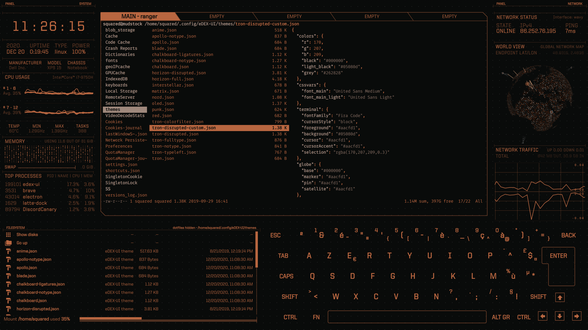

<p align="center">
  <br>
  
  <br><br>
  <a href="https://github.com/GxxkX/edex-ui-golang/releases/latest"></a>
  <a href="https://github.com/GxxkX/edex-ui-golang/blob/master/LICENSE"></a>
  <br>
  <a href="https://github.com/GxxkX/edex-ui-golang/releases/download/latest/edex-ui-golang-windows.exe" target="_blank"></a>
  <a href="https://github.com/GxxkX/edex-ui-golang/releases/download/latest/edex-ui-golang-macos.dmg" target="_blank"></a>
  <a href="https://github.com/GxxkX/edex-ui-golang/releases/download/latest/edex-ui-golang-linux.AppImage" target="_blank"></a>
  <br><br><br>
</p>

# eDEX-UI Golang

A cross-platform, customizable science fiction terminal emulator with advanced monitoring & touchscreen support, rebuilt using **Go** and **Wails** framework.

---

<a href="https://youtu.be/BGeY1rK19zA">
  
</a>

Heavily inspired from the [TRON Legacy movie effects](https://web.archive.org/web/20170511000410/http://jtnimoy.com/blogs/projects/14881671) (especially the [Board Room sequence](https://gmunk.com/TRON-Board-Room)), this project is a complete rewrite of the original [eDEX-UI](https://github.com/GitSquared/edex-ui) using modern technologies.

While keeping a futuristic look and feel, it strives to maintain a certain level of functionality and to be usable in real-life scenarios, with the larger goal of bringing science-fiction UXs to the mainstream.

**This is a Go-based rebuild of the original eDEX-UI project, offering improved performance, better cross-platform compatibility, and modern architecture.**

### Why Go + Wails?

Because the original eDEX-UI was built using Electron, the overall software package was relatively large and consumed high system resources. This Go-based rebuild using **Golang + Wails + Vanilla** significantly reduces the software footprint:

- **Software size reduced to 41.9MB** (compared to the much larger Electron-based original)
- **Lower memory usage** and better performance
- **Faster startup times**
- **Better system integration**

*Note: Currently tested only on Windows 11. Cross-platform testing is ongoing.*

<br>

It might or might not be a joke taken too seriously.

---

<p align="center">
  <em>Jump to: <br><a href="#features">Features</a> — <a href="#screenshots">Screenshots</a> — <a href="#licensing">Licensing</a> — <a href="#中文版">中文版</a></em>
</p>

## Features

- **Fully featured terminal emulator** with tabs, colors, mouse events, and support for `curses` and `curses`-like applications
- **Real-time system monitoring** (CPU, RAM, swap, processes) and network monitoring (GeoIP, active connections, transfer rates)
- **Full touchscreen support** including an on-screen keyboard for touch-enabled displays
- **Directory viewer** that follows the CWD (current working directory) of the terminal
- **Advanced customization** using themes, on-screen keyboard layouts, and CSS injections
- **Optional sound effects** for maximum hollywood hacking vibe
- **Modern architecture** built with Go and Wails framework for better performance and cross-platform compatibility
- **Single instance protection** to prevent multiple instances from running simultaneously
- **Comprehensive settings management** with persistent configuration storage

## Screenshots


_[neofetch](https://github.com/dylanaraps/neofetch) on eDEX-UI Golang with the default "tron" theme & QWERTY keyboard_



_Checking out available themes with [`ranger`](https://github.com/ranger/ranger) on eDEX-UI Golang with the "blade" theme_


_[cmatrix](https://github.com/abishekvashok/cmatrix) on eDEX-UI Golang with the experimental "tron-disrupted" theme, and the user-contributed DVORAK keyboard_


_Editing source code with `nvim` on eDEX-UI Golang with a custom theme_

## Technical Details

This project is built using:

- **Backend**: Go 1.23+ with modern concurrency patterns
- **Frontend**: Wails v2 framework for native desktop applications
- **System Monitoring**: gopsutil for cross-platform system information
- **Terminal**: Custom terminal implementation with WebSocket support
- **UI**: HTML/CSS/JavaScript frontend with sci-fi theming
- **Architecture**: Modular design with separate managers for settings, network, system info, and terminal

## Building from Source

### Prerequisites

- Go 1.23 or later
- Node.js and npm
- Platform-specific build tools

### Build Instructions

```bash
# Clone the repository
git clone https://github.com/GxxkX/edex-ui-golang.git
cd edex-ui-golang

# Install dependencies
go mod download
cd frontend && npm install && cd ..

# Build the application
wails build
```

## Licensing

Licensed under the [GPL-3.0](https://github.com/GxxkX/edex-ui-golang/blob/master/LICENSE).

---

## 中文版

本项目同时提供中文版README文档，请查看 [README_CN.md](README_CN.md) 获取中文说明。

---

## Credits

This project is a complete rewrite of the original [eDEX-UI](https://github.com/GitSquared/edex-ui) by [Squared](https://github.com/GitSquared).

**eDEX-UI Golang** is developed and maintained by [Gxxkx](https://github.com/GxxkX).

### Original Credits

- [Squared](https://github.com/GitSquared) - Original eDEX-UI creator
- [PixelyIon](https://github.com/PixelyIon) - Windows compatibility assistance
- [IceWolf](https://soundcloud.com/iamicewolf) - Sound effects composer
- [Seena](https://github.com/seenaburns) - Inspiration from [DEX-UI](https://github.com/seenaburns/dex-ui)

### Dependencies

This project uses several open-source libraries and frameworks:

- [Wails](https://wails.io/) - Desktop app framework
- [gopsutil](https://github.com/shirou/gopsutil) - Cross-platform system information
- [go-ping](https://github.com/go-ping/ping) - ICMP ping implementation
- [gorilla/websocket](https://github.com/gorilla/websocket) - WebSocket support
- [aiopty](https://github.com/iyzyi/aiopty) - Pseudo-terminal support

---

<p align="center">
  <em>Made with ❤️ and Go</em>
</p>