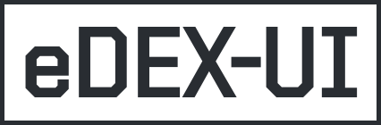
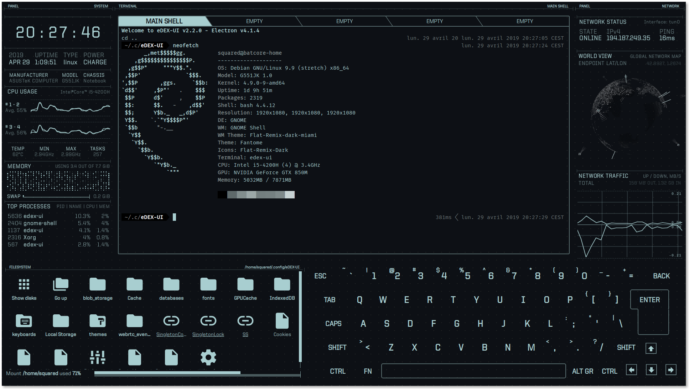
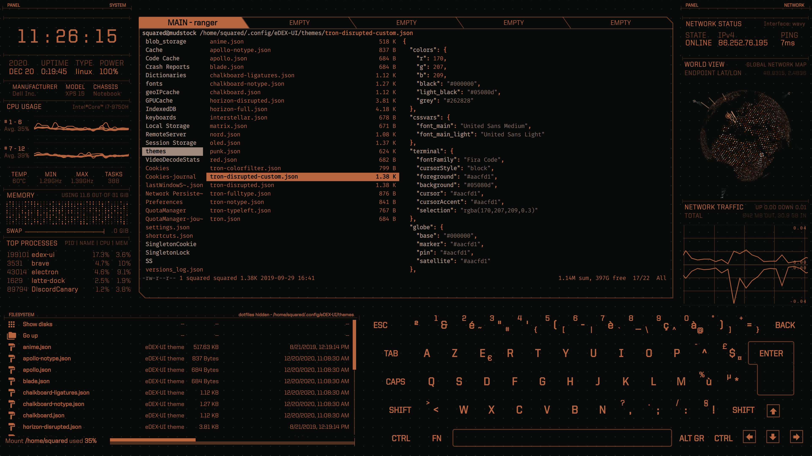
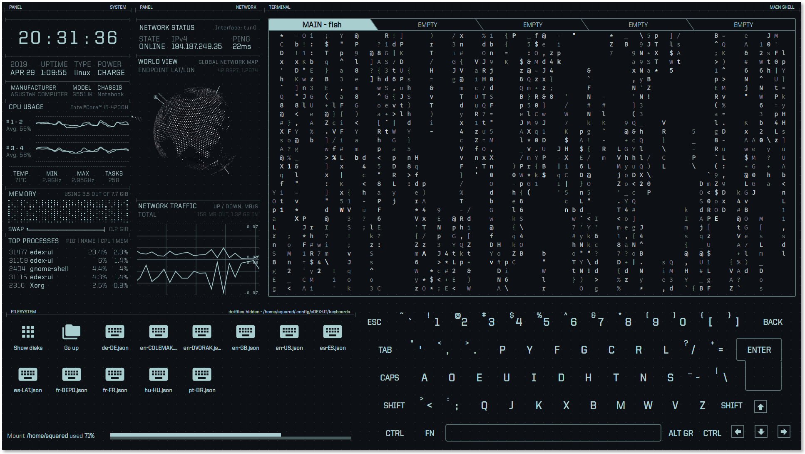
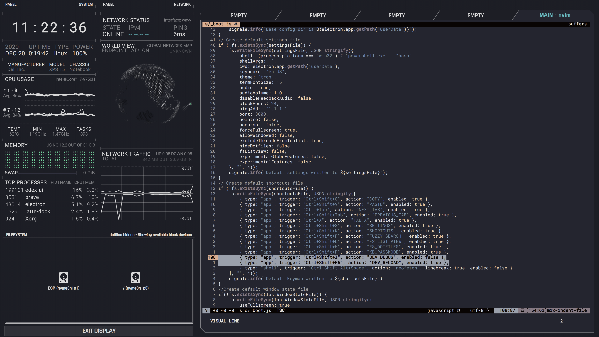

<p align="center">
  <br>
  
  <br><br>
  <a href="https://github.com/GxxkX/edex-ui-golang/releases/latest"></a>
  <a href="https://github.com/GxxkX/edex-ui-golang/blob/master/LICENSE"></a>
  <br>
  <a href="https://github.com/GxxkX/edex-ui-golang/releases/download/latest/edex-ui-golang-windows.exe" target="_blank"></a>
  <a href="https://github.com/GxxkX/edex-ui-golang/releases/download/latest/edex-ui-golang-macos.dmg" target="_blank"></a>
  <a href="https://github.com/GxxkX/edex-ui-golang/releases/download/latest/edex-ui-golang-linux.AppImage" target="_blank"></a>
  <br><br><br>
</p>

# eDEX-UI Golang

一个跨平台的、可定制的科幻风格终端模拟器，具有高级监控和触摸屏支持，使用 **Go** 和 **Wails** 框架重构。

---

<a href="https://youtu.be/BGeY1rK19zA">
  
</a>

深受 [TRON Legacy 电影特效](https://web.archive.org/web/20170511000410/http://jtnimoy.com/blogs/projects/14881671)（特别是 [董事会场景](https://gmunk.com/TRON-Board-Room)）的启发，本项目是对原始 [eDEX-UI](https://github.com/GitSquared/edex-ui) 的完全重写，使用现代技术栈。

在保持未来主义外观和感觉的同时，它努力维持一定的功能水平并在真实场景中可用，更大的目标是将科幻用户体验带入主流。

**这是原始 eDEX-UI 项目的 Go 语言重构版本，提供更好的性能、更强的跨平台兼容性和现代架构。**

### 为什么选择 Go + Wails？

由于原始的 eDEX-UI 使用 Electron 构建，整体软件包相对较大，系统占用资源较高。因此我使用 **Golang + Wails + Vanilla** 重构了应用程序，显著减少了软件占用空间：

- **软件大小减少至 41.9MB**（相比基于 Electron 的原始版本大幅减少）
- **更低的内存使用**和更好的性能
- **更快的启动时间**
- **更好的系统集成**

*注意：目前仅在 Windows 11 上测试。跨平台测试正在进行中。*

<br>

这可能是一个被认真对待的笑话，也可能不是。

---

<p align="center">
  <em>跳转到：<br><a href="#功能特性">功能特性</a> — <a href="#截图展示">截图展示</a> — <a href="#开源许可">开源许可</a> — <a href="#english-version">English Version</a></em>
</p>

## 功能特性

- **功能完整的终端模拟器**，支持标签页、颜色、鼠标事件，以及对 `curses` 和类似应用程序的支持
- **实时系统监控**（CPU、内存、交换分区、进程）和网络监控（地理位置IP、活动连接、传输速率）
- **完整的触摸屏支持**，包括触摸屏设备的屏幕键盘
- **目录查看器**，跟随终端的当前工作目录（CWD）
- **高级自定义**，使用主题、屏幕键盘布局和CSS注入
- **可选的音效**，营造极致的好莱坞黑客氛围
- **现代架构**，使用Go和Wails框架构建，提供更好的性能和跨平台兼容性
- **单实例保护**，防止多个实例同时运行
- **全面的设置管理**，支持持久化配置存储

## 截图展示



_在 eDEX-UI Golang 上运行 [neofetch](https://github.com/dylanaraps/neofetch)，使用默认的 "tron" 主题和 QWERTY 键盘_



_在 eDEX-UI Golang 上使用 [`ranger`](https://github.com/ranger/ranger) 查看可用主题，使用 "blade" 主题_



_在 eDEX-UI Golang 上运行 [cmatrix](https://github.com/abishekvashok/cmatrix)，使用实验性的 "tron-disrupted" 主题和用户贡献的 DVORAK 键盘_



_在 eDEX-UI Golang 上使用 `nvim` 编辑源代码，使用自定义主题_

## 技术细节

本项目使用以下技术构建：

- **后端**：Go 1.23+ 与现代并发模式
- **前端**：Wails v2 框架用于原生桌面应用程序
- **系统监控**：gopsutil 用于跨平台系统信息
- **终端**：自定义终端实现，支持WebSocket
- **界面**：HTML/CSS/JavaScript 前端，具有科幻主题
- **架构**：模块化设计，分别管理设置、网络、系统信息和终端

## 从源码构建

### 前置要求

- Go 1.23 或更高版本
- Node.js 和 npm
- 平台特定的构建工具

### 构建说明

```bash
# 克隆仓库
git clone https://github.com/GxxkX/edex-ui-golang.git
cd edex-ui-golang

# 安装依赖
go mod download
cd frontend && npm install && cd ..

# 构建应用程序
wails build
```

## 开源许可

基于 [GPL-3.0](https://github.com/GxxkX/edex-ui-golang/blob/master/LICENSE) 许可证。

---

## English Version

This project also provides an English README document. Please check [README.md](README.md) for English documentation.

---

## 致谢

本项目是对原始 [eDEX-UI](https://github.com/GitSquared/edex-ui) 的完全重写，原作者是 [Squared](https://github.com/GitSquared)。

**eDEX-UI Golang** 由 [Gxxkx](https://github.com/GxxkX) 开发和维护。

### 原始致谢

- [Squared](https://github.com/GitSquared) - 原始 eDEX-UI 创造者
- [PixelyIon](https://github.com/PixelyIon) - Windows 兼容性协助
- [IceWolf](https://soundcloud.com/iamicewolf) - 音效作曲家
- [Seena](https://github.com/seenaburns) - 灵感来源 [DEX-UI](https://github.com/seenaburns/dex-ui)

### 依赖库

本项目使用了多个开源库和框架：

- [Wails](https://wails.io/) - 桌面应用框架
- [gopsutil](https://github.com/shirou/gopsutil) - 跨平台系统信息
- [go-ping](https://github.com/go-ping/ping) - ICMP ping 实现
- [gorilla/websocket](https://github.com/gorilla/websocket) - WebSocket 支持
- [aiopty](https://github.com/iyzyi/aiopty) - 伪终端支持

---

<p align="center">
  <em>用 ❤️ 和 Go 制作</em>
</p>


